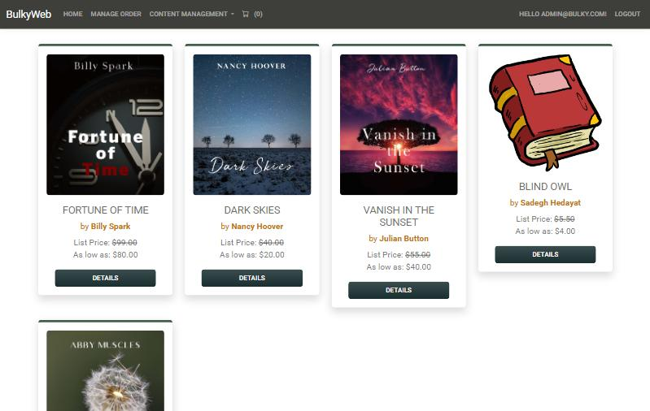
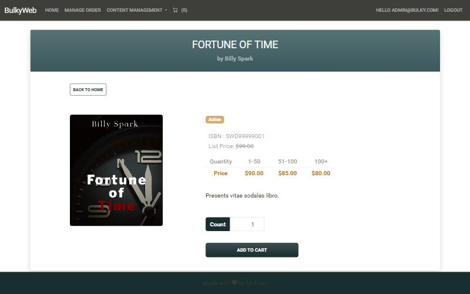
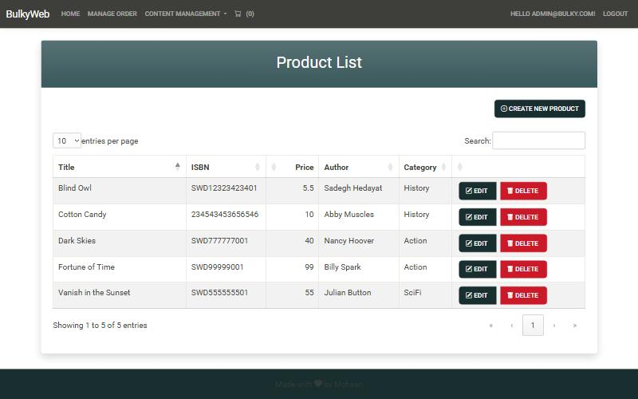
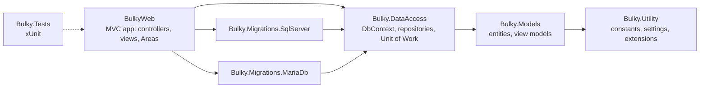

# BulkyWeb

[](https://github.com/mohsenmazaheri/BulkyWeb/actions/workflows/ci.yml)


An online bookstore built with **ASP.NET Core MVC**: a customer storefront with quantity-based pricing, a shopping cart and **Stripe** checkout, plus an admin portal for products, categories, companies, orders and users.

The project started from an ASP.NET Core MVC course. I then **audited it like a code review** and worked through the findings: security holes, bugs, missing tests and infrastructure. Each step is documented as a lesson in [`Documents/`](Documents/).



| Product details with price tiers | Admin product management |
|---|---|
|  |  |

---

## Features

**Customers**
- Browse books, view details, and see prices that drop for larger quantities (1–50, 51–100, 100+)
- Shopping cart, with the item count kept in the session
- Checkout with **Stripe** (test mode), order confirmation and order history

**Company accounts (B2B)**
- Orders are approved immediately and **paid later** (net 30), from the order details page

**Admin and employees**
- Manage products (with cover image upload and a rich-text editor), categories and companies
- Manage orders by status: in process, payment pending, completed, approved
- Ship orders with carrier and tracking number, cancel orders with automatic **Stripe refund**
- Create users with any role (Customer, Company, Employee, Admin)

---

## Tech stack

| Area | Technology |
|---|---|
| Framework | ASP.NET Core MVC on **.NET 10**, Razor views, Areas |
| Data | **Entity Framework Core 9**, Repository + Unit of Work pattern |
| Databases | **SQL Server** or **MariaDB** (Pomelo provider), chosen by one setting |
| Auth | ASP.NET Core Identity with roles |
| Payments | Stripe Checkout (Stripe.net) |
| Front end | Bootstrap 5, jQuery, DataTables, Toastr, SweetAlert2, TinyMCE |
| Tests | xUnit, Moq, EF Core InMemory |
| CI | GitHub Actions (build, tests, coverage, vulnerable-package check) |

---

## Architecture



- Controllers only talk to `IUnitOfWork`. They never use the `DbContext` directly.
- Each database provider has its **own migrations project**, because migrations contain provider-specific SQL. `DatabaseProvider` picks one at startup.
- On startup, `DbInitializer` applies pending migrations and creates the roles and the first admin.

---

## What I improved

Starting from a [full audit](Documents/Lesson%2000%20-%20Project%20Audit%20and%20Roadmap.docx), these issues were fixed. Each fix has its own write-up in [`Documents/`](Documents/).

| Area | Problem found | Fix |
|---|---|---|
| Security | **IDOR**: any logged-in user could view or change other users' carts and orders | Owner checks in every query, "owner or staff" rule for orders |
| Security | **CSRF**: anti-forgery tokens were never validated; GET requests changed data | Global `AutoValidateAntiforgeryToken`, POST-only actions, token sent with AJAX |
| Security | **Path traversal**: a tampered form field could delete any file on the server | Only files inside the image folder can be deleted |
| Security | Order list JSON sent every user's **password hash** to the browser | Endpoint returns only the six columns the table needs |
| Security | Admin password **hard-coded** in a public repo | First admin read from configuration / user secrets |
| Bugs | Order status tabs compared the wrong field (two tabs were always empty) | Fixed with **TDD**: failing test first |
| Bugs | App crashed on a fresh database (leftover model change) | New migration, startup now idempotent |
| Bugs | Missing covers, upload crash on new machines, Windows-only paths | Placeholder image, folder creation, portable paths |
| Data integrity | Deleting a category or product **cascaded into order history** | Soft delete for products, `Restrict` foreign keys, friendly refusals |
| Correctness | Money stored as `double`: Stripe charged **$19.98 for a $19.99 book** | `decimal(18,2)` everywhere, exact cent conversion for Stripe |
| Infrastructure | SQL Server only | SQL Server **and** MariaDB, with separate migrations |
| Dependencies | Outdated packages, one high-severity vulnerability | Updated packages, removed unused ones, CI check |
| Quality | No tests, no CI | **78 tests**, GitHub Actions on every push and PR, protected `master` |

---

## Getting started

### Prerequisites
- [.NET 10 SDK](https://dotnet.microsoft.com/download/dotnet/10.0)
- **SQL Server** (any edition, including Express or LocalDB) **or MariaDB 11.4**

### 1. Clone and restore tools

```bash
git clone https://github.com/mohsenmazaheri/BulkyWeb.git
cd BulkyWeb
dotnet tool restore
```

### 2. Configure the database
**SQL Server** is the default. It connects to `Server=.` with Windows authentication, so a local SQL Server needs no configuration. For another server, set `ConnectionStrings:SqlServer`.

**MariaDB:** create a database user (see [`scripts/create-mariadb-user.sql`](scripts/create-mariadb-user.sql)), then:

```bash
dotnet user-secrets set "DatabaseProvider" "MariaDb" --project BulkyWeb
dotnet user-secrets set "ConnectionStrings:MariaDb" "Server=localhost;Port=3306;Database=Bulky;User=bulky;Password=YOUR_PASSWORD" --project BulkyWeb
```

### 3. Set the first admin's password
On an empty database the app creates the admin account `admin@bulky.com`. Its password is never stored in the repository:

```bash
dotnet user-secrets set "AdminUser:Password" "YOUR_ADMIN_PASSWORD" --project BulkyWeb
```

### 4. Stripe (optional, for checkout)
Use the keys from your Stripe dashboard in **test mode**:

```bash
dotnet user-secrets set "Stripe:SecretKey" "sk_test_..." --project BulkyWeb
dotnet user-secrets set "Stripe:PublishableKey" "pk_test_..." --project BulkyWeb
```

Pay with Stripe's test card `4242 4242 4242 4242`, any future date and any CVC.

### 5. Run

```bash
dotnet run --project BulkyWeb --launch-profile https
```

Open https://localhost:7197. On the first start the database, tables, sample books, roles and the admin account are created automatically.

---

## Tests

```bash
dotnet test Bulky.sln
```

78 tests cover:
- the IDOR and CSRF-related rules;
- pricing tiers at their boundaries, and exact money arithmetic;
- soft delete and order history protection;
- order status filtering;
- image upload safety (including the path traversal attacks);
- the startup initializer, run against the real ASP.NET Core Identity.

They run on every push and pull request in [GitHub Actions](https://github.com/mohsenmazaheri/BulkyWeb/actions).

## Database migrations

Every model change needs a migration for **both** providers. The script creates both:

```powershell
.\scripts\add-migration.ps1 AddSomething
```

---

## Roadmap

- Stripe **webhooks**, so payments are confirmed even if the customer closes the browser
- Async data access and a service layer for orders and payments
- Docker image and cloud deployment

---

## Author

**Mohsen Mazaheri**: [github.com/mohsenmazaheri](https://github.com/mohsenmazaheri)
